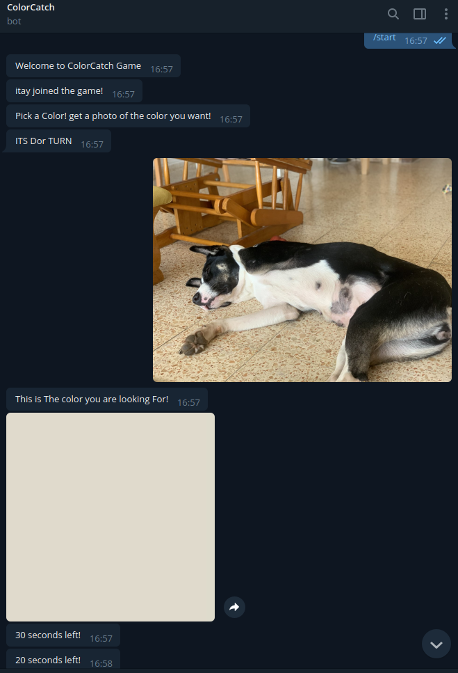
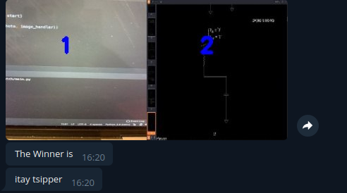

# ColorCatch
MultiPlayer Virtual ColorCatch game!

##The Game
Users connects to the game. 
in each turn, one player send an image of an object and the game calculate the color of the center of the img and sends it to all other users.
they have a limited time to send back a photo with a similiar color in it's center.
int the end - the player with the most close color - win. 
the game sends a ranking table , ranked by similar color to most diffrent color sent by all the players.
the similarity between colors is based on hue instead of RGB.

## Want to help?
This is just a basic game with a lot of improvements possible.
you can create a new API to the game if you want.
also , this is the main Tasks:
- [X] create Telegram Bot
- [ ] make more full solution for special cases (no one send photo, etc..)
- [ ] create ranking for all turns combined
- [ ] make a better-looking ranking photo
- [ ] make a color name option (blue,red, etc..)
- [ ] (option) - add locks to face race conditions

## The API
The main code is in game.py. The game is not a standalone and it built to work with diffrent API's to be relevant to diffrent front-end solutions.
So the game class need to get an class API to work - a class that derives from ConnectApi.py.
in ConnectApi.py file you can see the instruction for creating an api to the game.
The API will run in different thread than the game and handles all GET/POST methods from the users.
The game is a reader-only user of the data in the API.

## The API example - Telegram Bot
One example of working api to the game - that make it work as a telegram bot.
its under api_example dir in this repo.

